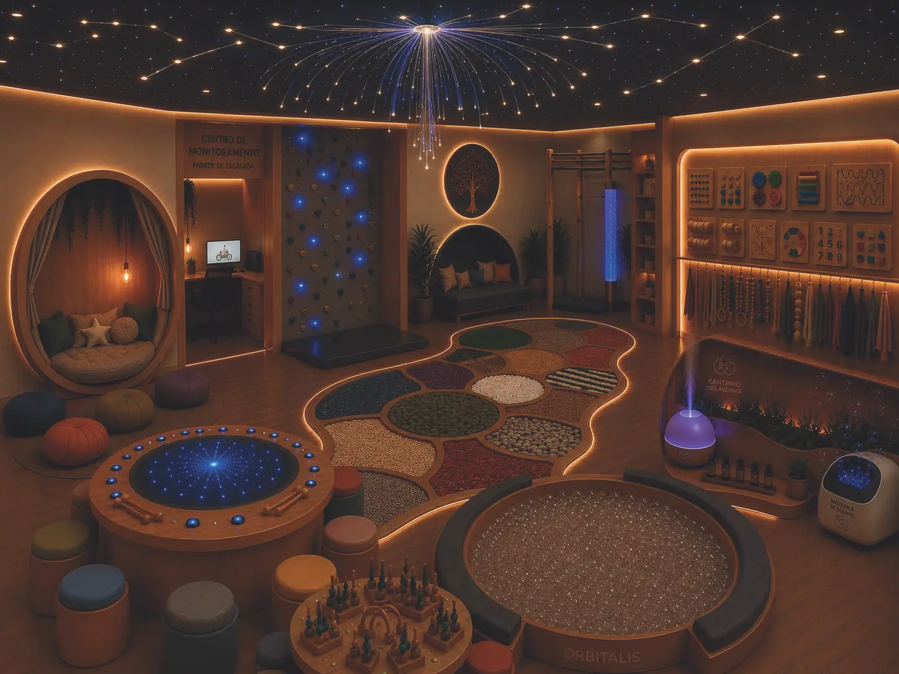
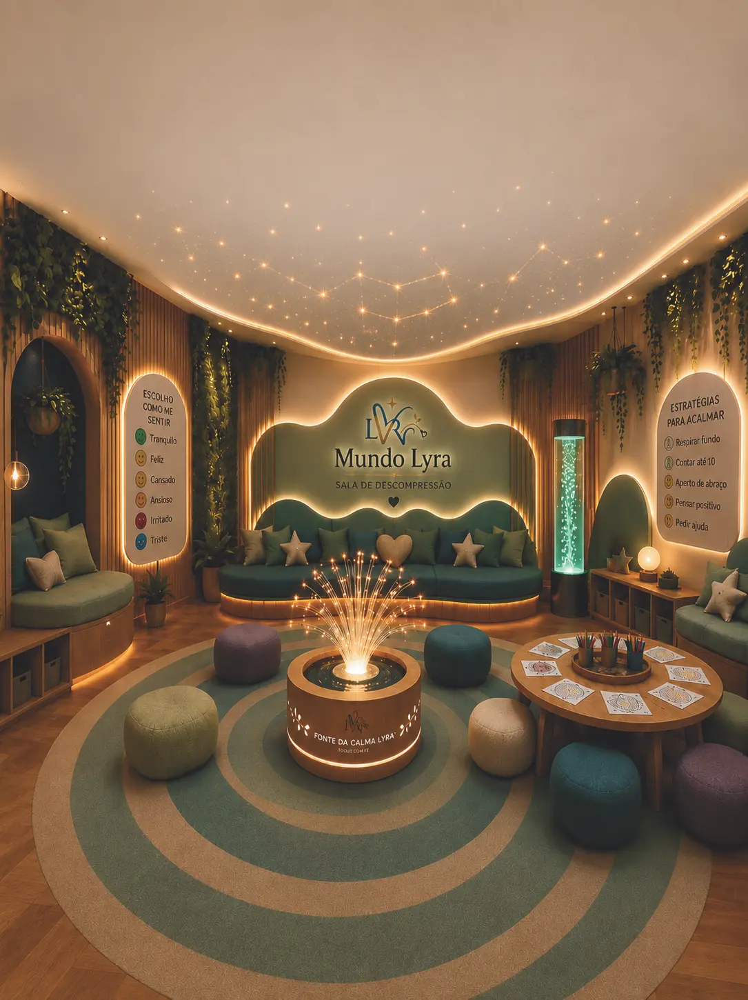

# 🌟 Mundo Lyra — Ambientes Sensoriais & Neuroinclusivos

[](https://nextjs.org/)
[](https://react.dev/)
[](https://www.typescriptlang.org/)
[](https://vercel.com/)
[](#)

> **Uma criação Foco Soluções Educacionais**  
> Plataforma web e catálogo interativo 3D apresentando soluções em mobiliários e ambientes adaptados para desenvolvimento socioemocional, autorregulação e integração sensorial no ambiente escolar.

---

## 📸 Demonstração do Projeto

<div align="center">
  
  
</div>

---

## ✨ Principais Funcionalidades

- **📖 Caderno Interativo 3D:** Simulação física realista de um livro de catálogo com virada de página responsiva a gestos de arraste (*drag & swipe*), clique ou botões de navegação.
- **📱 Design Adaptativo Inteligente (Mobile & Desktop):** 
  - **Desktop:** Exibição panorâmica das páginas em proporção `4:3`.
  - **Mobile:** Ajuste automático em formato retrato `9:14` com física de swipe suave (sem retrocesso de página).
- **🎨 Estética Neuroinclusiva & Premium:** Paleta de cores cuidadosamente selecionada, gradientes harmônicos em azul e vermelho, suporte a modo calmo (*calm mode*) e micro-animações acessíveis.
- **📑 Trilho de Produtos (`Product Rail`):** Navegação rápida entre os capítulos da coleção (Sala Sensorial, Sala de Descompressão, etc.), exibindo destaques pedagógicos, mantras e composições de ambiente.
- **📄 Download de Catálogos & Integração Comercial:** Acesso direto aos PDFs oficiais e botão de orçamento integrado ao WhatsApp da equipe comercial.

---

## 🛠️ Tecnologias Utilizadas

- **Framework:** [Next.js 16 (App Router)](https://nextjs.org/)
- **Biblioteca UI:** [React 19](https://react.dev/)
- **Linguagem:** [TypeScript](https://www.typescriptlang.org/)
- **Estilização:** Vanilla CSS3 + CSS Variables + [TailwindCSS v4](https://tailwindcss.com/)
- **ORM & Banco de Dados:** [Drizzle ORM](https://orm.drizzle.team/)
- **Hospedagem & Deploy:** [Vercel](https://vercel.com/)

---

## 🚀 Como Rodar o Projeto Localmente

### Pré-requisitos
- **Node.js** `>= 22.13.0`
- **npm** ou **yarn** / **pnpm**

### Passo a Passo

1. **Clone o repositório:**
   ```bash
   git clone https://github.com/joao-luizzz/Lyra.git
   cd Lyra
   ```

2. **Instale as dependências:**
   ```bash
   npm install
   ```

3. **Inicie o servidor de desenvolvimento:**
   ```bash
   npm run dev
   ```

4. **Acesse no seu navegador:**
   [http://localhost:3000](http://localhost:3000)

---

## 📦 Scripts Disponíveis

- `npm run dev`: Inicia o servidor de desenvolvimento com Next.js.
- `npm run build`: Cria o bundle otimizado de produção.
- `npm run start`: Inicia o servidor em modo de produção.
- `npm run lint`: Executa a verificação de linter e padrão de código.

---

## 🏢 Sobre a Foco Soluções Educacionais

A **Foco Soluções Educacionais** desenvolve projetos e recursos pedagógicos neuroinclusivos pautados em evidências científicas, promovendo ambientes escolares acolhedores que incentivam a empatia, autorregulação e o aprendizado significativo.

---

<div align="center">
  <sub>Desenvolvido com ❤️ para a Foco Soluções Educacionais</sub>
</div>
